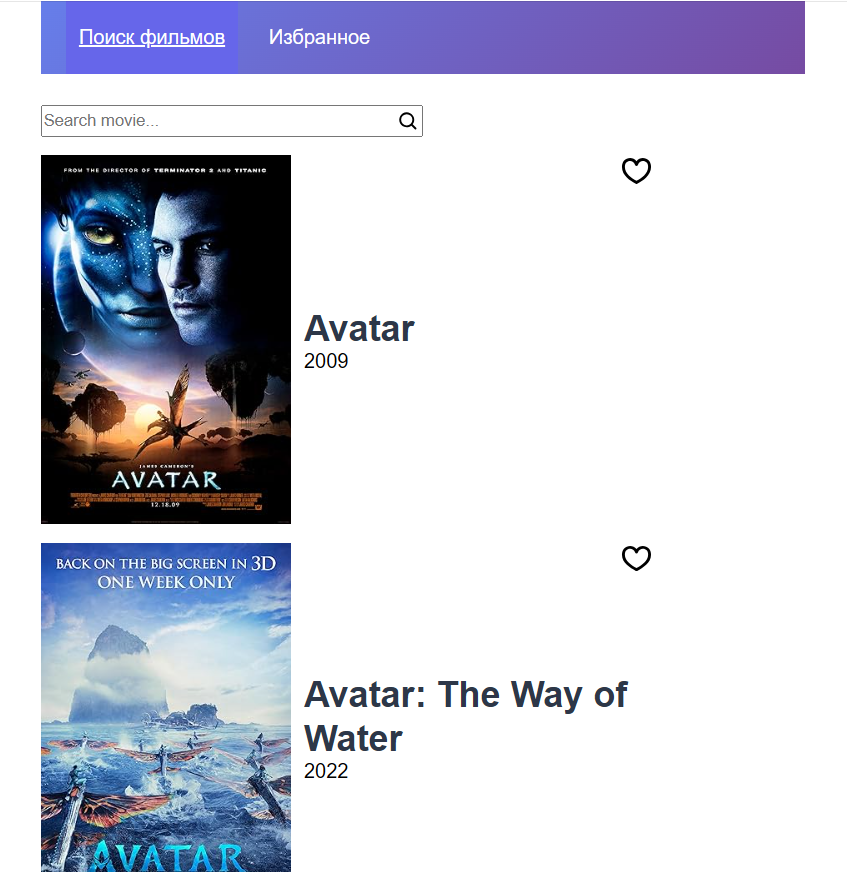
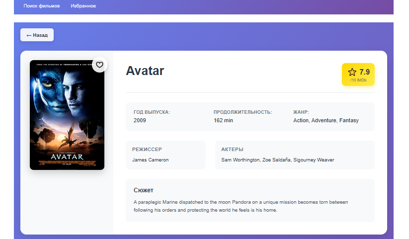
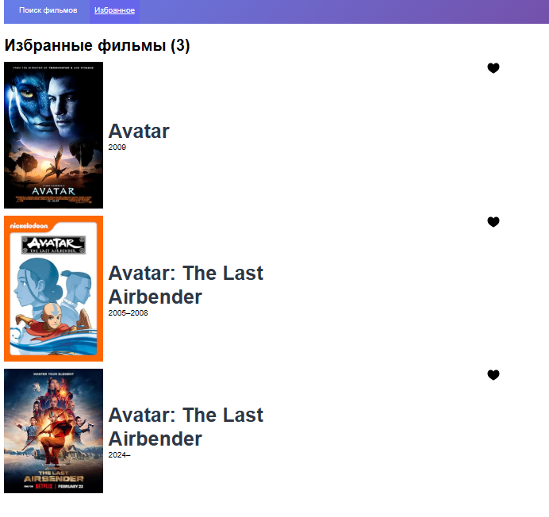

# 🎬 Movie Search App - Поиск фильмов с рейтингом IMDb [](https://ci.appveyor.com/project/AntonyCoder/kinopoisk)

Доступ к приложению https://antonycoder.github.io/Kinopoisk/

Современное веб-приложение для поиска и управления коллекцией фильмов с интеграцией IMDb API. Приложение построено на React с использованием Redux Toolkit для управления состоянием и React Router для навигации.

## 📋 Содержание

- [Обзор проекта](#обзор-проекта)
- [Основные функции](#основные-функции)
- [Технологический стек](#технологический-стек)
- [Архитектура приложения](#архитектура-приложения)
- [Установка и запуск](#установка-и-запуск)
- [Структура проекта](#структура-проекта)
- [API интеграция](#api-интеграция)
- [Скриншоты интерфейса](#скриншоты-интерфейса)
- [Планы развития](#планы-развития)

## 🎯 Обзор проекта

**Movie Search App** — это интуитивное веб-приложение, которое позволяет пользователям легко находить фильмы по названию, просматривать подробную информацию о них и создавать персональную коллекцию избранных фильмов. Приложение использует официальный API IMDb для получения актуальной информации о фильмах, включая рейтинги, постеры, описания и метаданные.

### Ключевые особенности:
- 🔍 **Быстрый поиск** — мгновенный поиск фильмов по названию
- 📊 **Рейтинги IMDb** — отображение официальных рейтингов и оценок
- ❤️ **Система избранного** — сохранение понравившихся фильмов

## 🚀 Основные функции

### 1. Поиск фильмов по названию
- **Интуитивный поиск**: Простое поле ввода с кнопкой поиска
- **Мгновенные результаты**: Асинхронная загрузка результатов поиска
- **Обработка ошибок**: Информативные сообщения при отсутствии результатов

### 2. Открытие страницы фильма
- **Подробная информация**: Полная информация о фильме включая:
  - Название и год выпуска
  - Рейтинг IMDb с визуальным отображением
  - Продолжительность и жанр
  - Информация о режиссере и актерах
  - Описание сюжета
- **Высококачественные постеры**: Отображение постеров с fallback на дефолтное изображение
- **Навигация**: Удобная кнопка "Назад" для возврата к результатам поиска

### 3. Добавление фильмов в избранное
- **Простое управление**: Один клик для добавления/удаления из избранного
- **Визуальная обратная связь**: Изменение иконки сердца при добавлении в избранное
- **Страница избранного**: Отдельная страница для просмотра всех избранных фильмов
- **Счетчик**: Отображение количества избранных фильмов

## 🛠 Технологический стек

### Frontend
- **React 19.1.1** — современная библиотека для создания пользовательских интерфейсов
- **Redux Toolkit 2.9.0** — предсказуемый контейнер состояния для JavaScript приложений
- **React Router DOM 7.9.3** — маршрутизация для React приложений
- **React Redux 9.2.0** — официальные React биндинги для Redux

### Сборка и разработка
- **Vite 7.1.2** — быстрый инструмент сборки для современного веб-разработки
- **ESLint 9.33.0** — статический анализатор кода для JavaScript
- **@vitejs/plugin-react 5.0.0** — официальный плагин React для Vite

### UI и иконки
- **@gravity-ui/icons 2.16.0** — набор современных SVG иконок
- **CSS3** — стилизация с использованием современных CSS возможностей

## 🏗 Архитектура приложения

### Структура состояния (Redux Store)
```
store/
├── movies: {
│   ├── items: []           // Результаты поиска
│   ├── currentMovie: null  // Текущий просматриваемый фильм
│   ├── loading: false      // Состояние загрузки
│   └── error: null         // Ошибки API
│   }
└── favorites: {
    └── items: []           // Избранные фильмы
    }
```

### Компонентная архитектура
```
src/
├── components/
│   ├── Header/             # Навигационная панель
│   ├── MainPage/           # Главная страница с поиском
│   ├── SearchInput/        # Компонент поиска
│   ├── FilmItem/           # Карточка фильма
│   ├── FilmItemPage/       # Страница детальной информации
│   └── FavoritePage/       # Страница избранных фильмов
├── slices/
│   ├── movieSlice.js       # Логика работы с фильмами
│   └── favoritesSlice.js   # Логика избранного
└── store/
    └── store.js            # Конфигурация Redux store
```

## ⚙️ Установка и запуск

### Предварительные требования
- Node.js версии 16 или выше
- npm или yarn
- API ключ от OMDb API

### Шаги установки

1. **Клонирование репозитория**
   ```bash
   git clone <repository-url>
   cd Kinopoisk
   ```

2. **Установка зависимостей**
   ```bash
   npm install
   ```

3. **Настройка переменных окружения**
   Создайте файл `.env` в корне проекта:
   ```env
   VITE_API_URL=http://www.omdbapi.com/
   VITE_API_KEY=your_api_key_here
   ```

4. **Запуск в режиме разработки**
   ```bash
   npm run dev
   ```

5. **Сборка для продакшена**
   ```bash
   npm run build
   ```

## 🔌 API интеграция

### OMDb API
Приложение использует [OMDb API](http://www.omdbapi.com/) для получения информации о фильмах.

#### Основные эндпоинты:
- **Поиск фильмов**: `?apikey={key}&s={title}` — поиск по названию
- **Детали фильма**: `?apikey={key}&i={imdbID}` — получение полной информации

#### Обработка данных:
- **Асинхронные запросы** через Redux thunks
- **Обработка ошибок** с информативными сообщениями
- **Состояния загрузки** для улучшения UX
- **Fallback изображения** при отсутствии постеров

## 📸 Скриншоты интерфейса

### Главная страница с поиском


**Описание**: Главная страница содержит поле поиска с иконкой лупы и отображает результаты поиска в виде сетки карточек фильмов. Каждая карточка показывает постер, название, год выпуска и кнопку добавления в избранное.

### Страница детальной информации о фильме


**Описание**: Детальная страница фильма отображает крупный постер, название, рейтинг IMDb, метаданные (год, продолжительность, жанр), информацию о создателях и актерах, а также описание сюжета. Включена кнопка "Назад" и возможность добавления в избранное.

### Страница избранных фильмов


**Описание**: Страница избранного показывает все сохраненные пользователем фильмы в виде сетки карточек. Отображается счетчик количества избранных фильмов. При отсутствии избранных фильмов показывается соответствующее сообщение с ссылкой на поиск.


